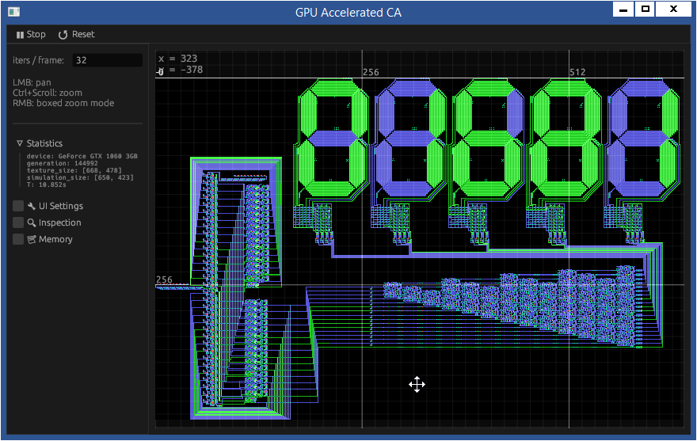

### Hutton32 CA simulation on GPU
Run with: `cargo run --release`

```
profiling for {
  device: GeForce GTX 1060 3GB
  simulation_dimm: 633x449,
  generations: 8192,
  iters/frame: 32
}

hutton32, naive branching -> 7.803s
hutton32, LUT 32MB        -> 5.695s (memory bound)
```



### Limitations
- Currently, `wgpu::Device::create_shader_module` will panic, if the source code is invalid. As such, it is impossible to implement a robust runtime shader recompilation.  
This must be addressed by wgpu developers.
- Even though `egui` supports compiling on `wasm32` target, currently `wgpu` is being emulated in browser using WebGL2. This enforces major restrictions on shader capabilities, most importantly lack of storage buffer type - thus rendering compute stage to be useless in any practical scenarios. This might change with the stabilization of [WebGPU](https://caniuse.com/webgpu), hence WebGL emulation layer no longer necessary - finally allowing us to perform scientific gpu computations both on native and web.
---

# 2026 Update

### Project structure
```
Cargo.toml                 eframe/egui 0.20, wgpu 0.14 (naga 0.10), wgsl_preprocessor 1.1, image 0.24
src/main.rs                eframe native app on the wgpu renderer
src/gui.rs                 controls, iters/frame, statistics, egui Plot viewport
src/gpu/mod.rs             GPUDriver: shader build, bind group, render + compute pipelines, paint callback
src/gpu/gpu_automata.rs    LUT build, PNG → state loader, step loop, 32-colour palette (HUTTON32_COLORS)
src/kernel/main.wgsl       bindings + //!include hub (palette injected via //!define)
src/kernel/compute.wgsl    compute_main (one step), compute_lut (LUT build); selects the rule
src/kernel/util.wgsl       get_cell / set_cell (double-buffered cell record)
src/kernel/vertex.wgsl     full-screen quad
src/kernel/fragment.wgsl   plot bounds → cell → palette colour
src/kernel/rules/          hutton32, hutton32b (active), hutton32-branchless, game_of_life
doc/                       presets (1 px = 1 cell), screenshot, component sheet
```

### How it works
1. **Startup and recompile** — `GPUDriver::new` assembles `src/kernel/main.wgsl` from disk with `wgsl_preprocessor`, then runs `compute_lut` once. It evaluates the rule for all 2²⁵ five-cell neighbourhoods and stores the results in a 32 MiB byte LUT (4 entries per `u32`, indexed by `c<<20 | n<<15 | e<<10 | s<<5 | w`). The rule function only runs here, so its complexity doesn't affect step speed.
2. **Pattern load** — `load_simulation` maps each PNG pixel to its palette index and uploads one `u32` per cell.
3. **Each frame** — the egui paint callback runs `compute_main` *iters/frame* times (read 5 cells → LUT lookup → write the next state), then renders into an offscreen texture that the plot displays.

**Cell record** (`src/kernel/util.wgsl`): bits 0–7 and 8–15 are two state slots used alternately, and bit 16 is the parity bit that selects the current one. Cells are updated in place: during a dispatch, neighbours read a cell's current slot while that cell's word is being rewritten. This is only safe because `set_cell` leaves the current slot intact, so any change to the record layout must preserve that. Each LUT field is 5 bits, which limits rules to the von Neumann neighbourhood and at most 32 states.

**Controls**: Space — start/stop, R — reset, S — single step, Ctrl+R — recompile the shaders, rebuild the LUT and reload the pattern. LMB pans, Ctrl+Scroll zooms, RMB drags a zoom box. *iters/frame* accepts 1–512 and is remembered between runs.

### Rules
To switch rules, change the `//!include` on the first line of `src/kernel/compute.wgsl` and the function called in `compute_lut`, then press Ctrl+R.

- `hutton32.rule.wgsl` — Tim Hutton's Hutton32: Nobili32 with write-and-retract, rotation-invariant construction.
- `hutton32b.rule.wgsl` — **active**; Hutton32 with the changes below.
- `hutton32-branchless.rule.wgsl` — branch-free rewrite of Hutton32's helper functions; not used.
- `game_of_life.rule.wgsl` — predates the LUT and needs the 8-cell Moore neighbourhood, so it doesn't fit the current kernel.

Changes in hutton32b relative to hutton32:
- **XNOR confluent** — a quiescent confluent (25) with two head-on transmission inputs, and transmission cells on the other two sides that don't point into it, fires when both OTS inputs match: both quiescent or both excited (`xnor_crossing`, `xnor_output`; applied in states 25–28).
- **Crossings** — states 29–31 revert to 25 once `is_crossing` no longer holds.
- **End-of-line STS** — an excited STS with an empty output also stays excited when fed by an excited confluent or crossing state (`excited_STS_to_us` instead of `excited_STS_arrow_to_us`).

### Presets
Patterns are PNGs in `doc/`, one pixel per cell, and every colour must exactly match an entry of `HUTTON32_COLORS`. The pattern path is hardcoded in `load_simulation`.

- `hutton32b_8bit_counter.png` (191×197) — **default**: a decimal counter with a 3-digit 7-segment display, optimized for hutton32b. One counter tick takes 272 simulation steps, so *iters/frame* = 272 advances the display once per frame.
- `hutton32_squares.png` (650×423) — a 5-digit 7-segment display pattern.
- `hutton32_8bit_counter_old.png` (633×449) — the older, larger counter; same size as the profiling run above.
- `hutton32b_components.png` — component sheet (logic gates, clocks, multiplexers, BIN→BCD, 7-segment, …). It contains text and artwork, so it can't be loaded as a pattern.

`.gitignore` lists `/doc`, so new presets have to be added with `git add -f`.

### Known issues
In order of impact:

1. **Both compute kernels use `@workgroup_size(1)`.** Every workgroup is a single thread, so each warp runs 1 of its 32 lanes, and Pascal (the GTX 1060 above) keeps at most 32 workgroups resident per SM — only 32 of its 2048 thread slots. This, rather than LUT bandwidth, is the likely limiter: the LUT run above works out to about 4×10⁸ cell updates per second. The fix is tiled workgroups (8×8 or 16×16) with a bounds check. Each step also opens its own compute pass; recording all of a frame's dispatches in one pass would be cheaper.
2. **No boundary handling** — the `sim_boundary_check` call in `get_cell` is commented out. West and east neighbours wrap into the previous or next row; north of the first row and south of the last row read past the end of the buffer, and what comes back is backend-defined (zero, or a clamped index). The default preset has quiescent OTS on all four borders, and its only contacts across the row wrap (rows 135–138) don't point across the seam, so it is unaffected unless a signal reaches the border.
3. **Recompile still panics on invalid WGSL, but wgpu 0.14 can already avoid it** (an update to the Limitations note above). wgpu only panics on *uncaptured* errors: while `Device::push_error_scope(ErrorFilter::Validation)` is active, errors from `create_shader_module` and pipeline creation are stored in the scope and returned by `pop_error_scope` (see `ErrorSinkRaw::handle_error` in wgpu 0.14's `backend/direct.rs`). On native the returned future is already resolved. Wrapping `GPUDriver::new` in such a scope and keeping the old driver on error makes recompilation robust. File errors from `wgsl_preprocessor`, such as a missing include, go through a separate `expect()`.
4. **Paths are relative to the working directory** — `./src/kernel/…` and `./doc/…`. `wgsl_preprocessor` also resolves `//!include` targets against the working directory, not against `main.wgsl`'s folder. The binary only works when started from the repository root.
5. **The PNG loader is fragile.** The upload is the raw RGBA bytes with the red channel replaced by the state index, and the initial parity comes from bits 16–31 (blue and alpha). All cells start in step only because RGB PNGs load with alpha = 255; in an RGBA pattern, a fully transparent pixel with blue = 0 would start out of phase. Colours missing from the palette silently keep their red value as the state, and values of 32 or more corrupt the LUT index. The bundled presets use palette colours only.
6. **Minor**
   - The device name under Statistics comes from the first adapter of a separately created `wgpu::Instance`, which may not be the adapter eframe chose; egui-wgpu 0.20 doesn't expose eframe's adapter.
   - `expect("Failed to load {path}")` doesn't substitute `path`.
   - The LUT buffer is labelled "Simulation Buffer".
   - After Step is pressed while the simulation is running, the next Start shows T = 0 for that whole run.
