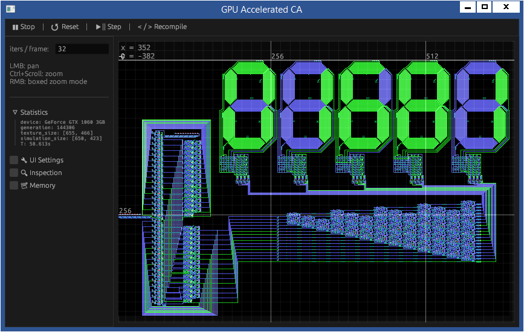

### Hutton32 CA simulation on GPU
Run with: `cargo run --release`

```
profiling for {
  device: GeForce GTX 1060 3GB
  simulation_dimm: 633x449,
  generations: 8192,
  iters/frame: 32
}

hutton32, naive branching -> 7.803s
hutton32, LUT 32MB        -> 5.695s (memory bound)
```



### Limitations
Currently, `wgpu::Device::create_shader_module` will panic, if the source code is invalid. As such, it is impossible to implement a robust runtime shader recompilation.  
This must be addressed by wgpu developers.